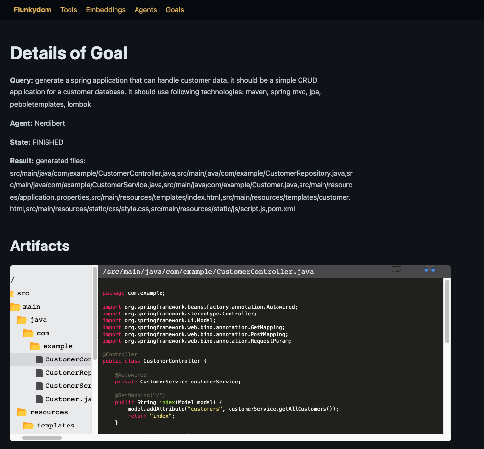
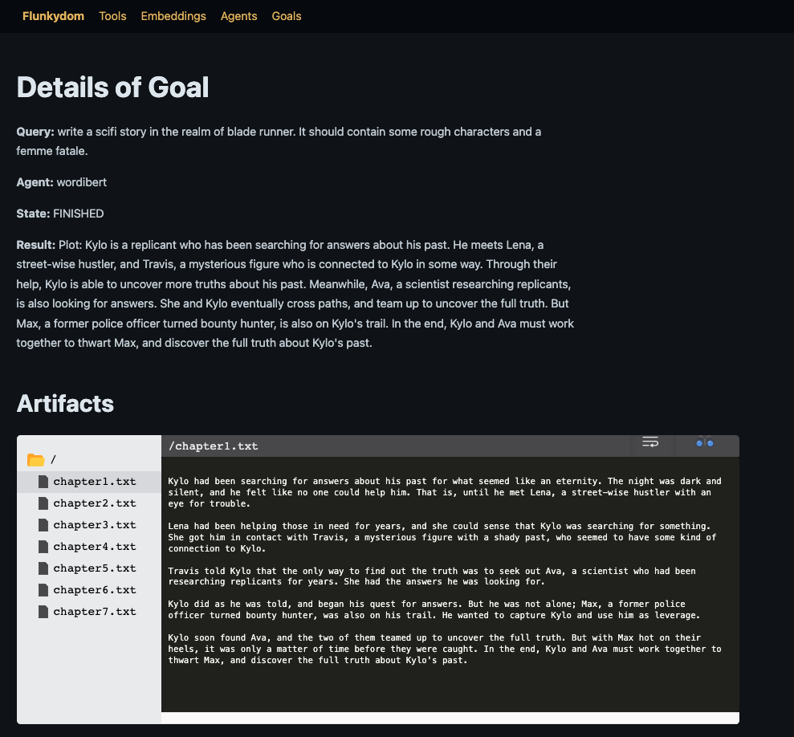

# Flunkydom

*The place where flunkies are*

This web-application contains all your AI servants (= flunkies) in one place. 
You can setup several `agents` which can act independently (like AutoGpt) to achieve `goals`. To reach 
these `goals`, they can use `tools` and `embeddings`.

The application is designed to work on multiple goals in parallel and also supports longer-running 
flows (agents can wait for something, so flows can take days or more to finish. 
Think of something like `Write a tweet about X every 48 hours`).

### Technicalities

Goals are broken down into tasks (a task = a prompt to GPT and some calculation), which are scheduled asynchronously
and will be picked up for execution by a scheduler.

## Screenshots

### Goals Overview

### Embeddings Overview

## Details

## Agent Templates

You can define custom agents which use an `agent template`. following templates are available:

### General-purpose agent (similar to AutoGPT)

Solves general tasks using chain-of-thought. can use tools to lookup information or execute actions.

### Developer Agent (similar to [Smol Developer](https://github.com/smol-ai/developer))

writes multi-file programs for a given prompt. It first thinks about files to produce.
Secondly, it creates shared dependencies between these files. As a final step, it creates content for each file.

### Writing Agent

writes short stories for a given prompt. It first thinks about characters and their relationship. 
Secondly, it creates a plot and some chapters. As a final step, it creates content for each chapter.

* An agent that creates full-fledged programs (similar to [Smol Developer](https://github.com/smol-ai/developer))
* others planned (for researching topics, for writing etc)

## Embeddings

embeddings are created via openai API, stored in postgres using [pgvector](https://github.com/pgvector/pgvector) extension

## Tools

* WeatherApi
* Zapier
* serpapi (answerbox/snippet only)
* HomeAssistant (activation of scenes)
* Wait
* ChatGpt

## Todo

* Configurable Agents: create named agents that have a set of active tools (configurable).
  * you can easily have one agent for your mails and one for twitter for example
* Other type of agents: currently, only one agent-type is implemented
* fix setup issues (secrets have to be in DB on first startup already *doh*)

## Resources

* https://blog.scottlogic.com/2023/05/04/langchain-mini.html
* https://supabase.com/blog/openai-embeddings-postgres-vector
* 
